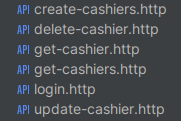

# Простое Rest API на Fiber фреймворке

Реализация CRUD Rest API на фреймворке Fiber с авторизацией по JWT токену.

В качестве базы данной была использована MySQL. Для запросов в БД был использован Gorm. 

Список доступного апи.



## Запуск проекта

```bash
docker compose up -d

go run main.go
```
